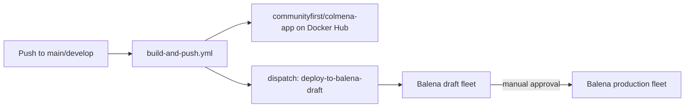

# colmena-unified


Unified single-container build (frontend + backend + nginx + supervisord)
for [Colmena](https://colmena.coop), an offline-first platform for
community radio and podcasting. Publishes
[`communityfirst/colmena-app`](https://hub.docker.com/r/communityfirst/colmena-app)
on Docker Hub, the image [`colmena-casaos-appstore`](https://github.com/coolabnet/colmena-casaos-appstore)
and Balena fleets depend on.

Successor to `colmena-os`, which is being retired now that this repo and
`colmena-casaos-appstore` cover its two live responsibilities (the unified
image build, and the CasaOS app-store packaging). `colmena-installer`
(multi-container Docker Compose stack, no CasaOS/Balena) is a separate,
unrelated repo and keeps its own lifecycle.

## ⚠️ Backend submodule currently points at a personal fork

`.gitmodules`'s `backend` submodule points at
`https://gitlab.com/luandro/backend.git` (branch
`fix/standalone-boot-nextcloud-optional`), **not** the canonical
`https://gitlab.com/colmena-project/dev/backend.git`. This is a deliberate,
temporary stopgap, not an oversight:

- The pinned commit contains a real fix (`create_superadmin` no longer
  crash-loops when Nextcloud is unreachable — required for this image to
  boot standalone, e.g. under CasaOS/Balena with no bundled Nextcloud).
- That fix has been submitted upstream as
  [MR !302](https://gitlab.com/colmena-project/dev/backend/-/merge_requests/302).
- A second, broader fix (Nextcloud graceful-degradation across several
  endpoints + allowing the `Superadmin` group to log in, both needed for a
  real standalone deployment to actually be usable) is submitted as
  [MR !301](https://gitlab.com/colmena-project/dev/backend/-/merge_requests/301).
- Neither is merged yet — pushing directly to `colmena-project/dev/backend`
  isn't possible without write access there.

**Once !301 and !302 (or equivalent fixes) land upstream**, repoint the
`backend` submodule at `https://gitlab.com/colmena-project/dev/backend.git`,
bump it to the merged commit, and delete this section. Until then, treat
the fork pointer as load-bearing, not incidental — don't "clean it up" by
repointing to upstream without carrying the fixes over first.

## What this image is

A single Docker image combining:
- **Frontend**: React PWA, built and served as static assets via nginx.
- **Backend**: Django REST API, served by gunicorn.
- **nginx**: serves the frontend and reverse-proxies to the backend.
- **supervisord**: runs both `nginx` and `gunicorn` inside the one container.

It deliberately ships without a bundled Nextcloud or mail server in v1 —
point `NEXTCLOUD_URL`/`EMAIL_HOST` at your own external instances after
install, or leave them blank. See `colmena-casaos-appstore`'s README for
the CasaOS-specific install flow and known gaps.

## Quick start (local Docker)

```bash
git clone --recursive https://github.com/coolabnet/colmena-unified.git
cd colmena-unified

cp .env.example .env
# edit .env: replace all CHANGE_ME values with secure passwords

docker compose up -d
docker compose logs -f colmena-app  # watch startup
```

- Frontend: http://localhost:8080
- Backend API: http://localhost:8000
- Default login: `SUPERADMIN_EMAIL`/`SUPERADMIN_PASSWORD` from `.env`

## Balena deployment

```bash
npm install -g balena-cli
balena login
balena push <your-fleet>
```

`.github/workflows/build-and-push.yml` builds and pushes
`communityfirst/colmena-app` on every push to `main`/`develop`, then
dispatches `deploy-balena-draft.yml` to push the same commit to the draft
Balena fleet automatically.

## Project structure

```
colmena-unified/
├── Dockerfile              # Unified multi-stage build (frontend + backend + nginx)
├── docker-compose.yml      # Local dev / full-stack compose
├── balena.yml              # Balena fleet configuration
├── .github/workflows/      # CI: build-and-push, Balena draft/production deploy,
│                            #     test-pipeline, infra validation
├── backend/                 # Django backend (submodule — see warning above)
├── frontend/                 # React frontend (submodule)
├── colmena-devops/          # Shared infra configs (submodule)
├── scripts/                 # Automation scripts
└── tests/                   # Balena testbed scripts, Playwright e2e
```

### Working with submodules

```bash
git submodule update --remote --merge   # update all submodules
cd frontend && git checkout -b feature/x   # work on one component
# ...commit, push in the submodule...
cd .. && git add frontend && git commit -m "Update frontend submodule"
```

## CI/CD



## Contributing

See [CONTRIBUTING.md](CONTRIBUTING.md).

## License

GPLv3 License — see [LICENSE](LICENSE) (matches `backend`/`frontend`).

## Acknowledgments

Colmena is built with support from:
- [Cambá Cooperative](https://camba.coop) — core platform development
- [Wakoma](https://wakoma.co) — hardware integration
- [CORAPE](https://corape.org.ec/) — community testing
- Community contributors worldwide
